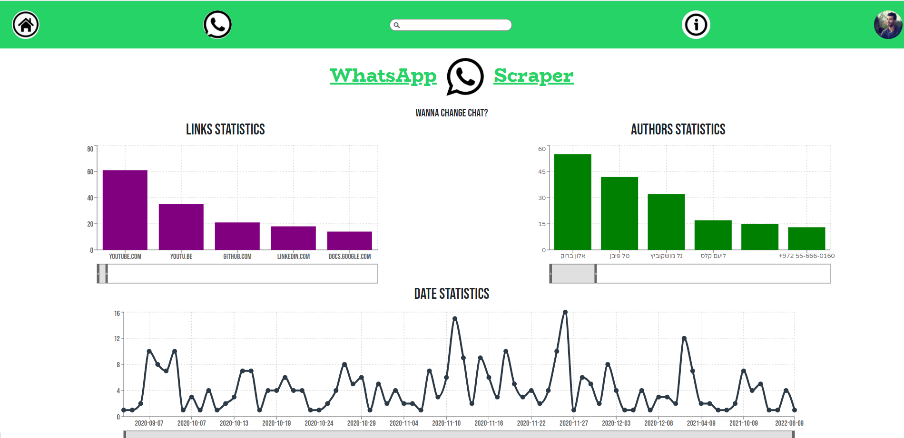
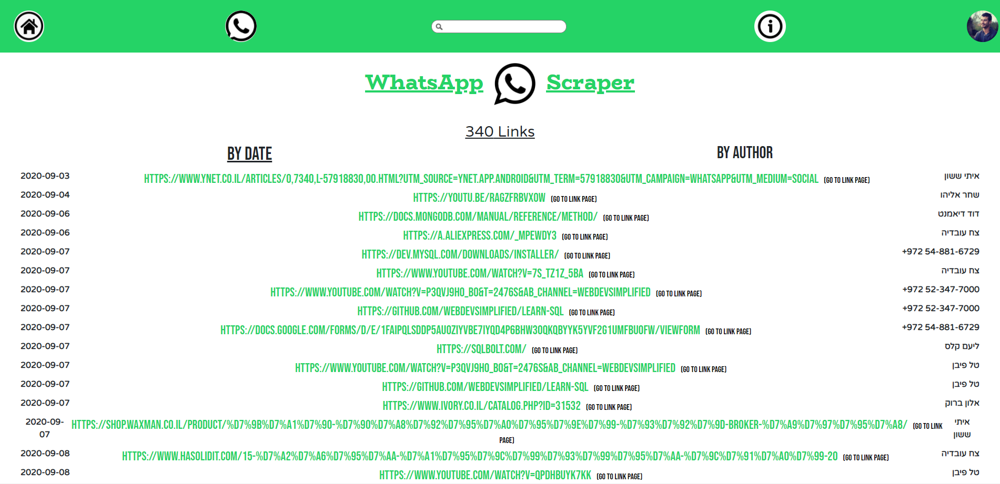
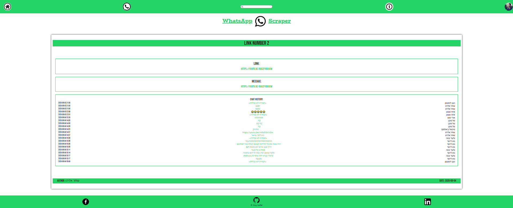
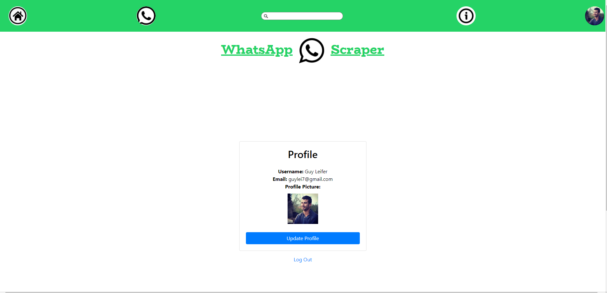
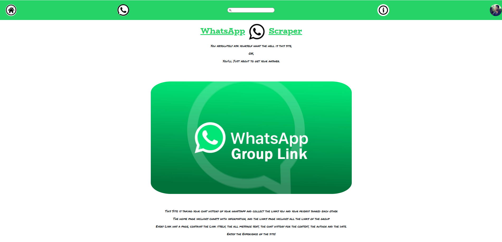

# whatapp-scrapper
## Enjoy The WhatsApp Links Scraper Service!
    this is a repository of a WhatsApp Links Scraper Service.
    the service offers a chat analysis of sharing links in the chat.
###
the repository includes database information from MongoDb, ("mongoose" package). 
server side with queries and packages: "express", "moment", "multer", "whatsapp-chat-parser", to make the service optimized for the best use.  
client side with usage of a lot of React packages, like: "recharts", "react-modal", "bootstrap", "react-bootstrap". for perfect use of the service.
client side also use "firebase" service for authentication, ("firebase" package).

## Instructions To Users
1. clone this repo to your device.
2. create a new MongoDB Database 
3. open the folder in your editor.
4. in the Server folder create a dotenv file and write there 2 variables:  
PORT = your server port.  
MONGODB = MongoDB connection  
5. make sure your device has docker and docker-compose installed.
6. in the main folder run the command "docker-compose build".
7. in the main folder run the command "docker-compose up".

## Home Page
    the home page contains a dashboard with three charts: 
### Authors chart
    showing how much links every user sent.
### Links chart
    showing how much links domains has sent separted by each domain.
### Date chart
    showing how much links have been sent by day.

## Search Bar
    the service conatains a navigation bar for searching a specific link/s

## Links Page
    the links page contains a list of all the links in the chat file, including the link itself, date and author.

## Link Page
    the link page contains details about the link from the chat, including the link itself, the all message has been sent, the history of the chat, the author and the date.

## Account Page
    the account page contains information about the user.

## About
    the about page contains information about the service.

## ENJOY!